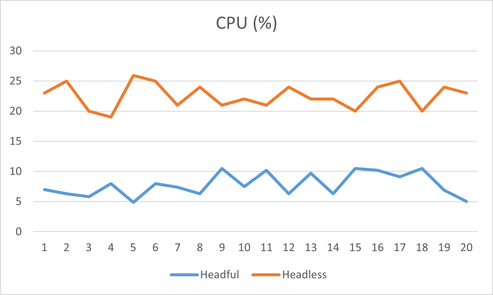
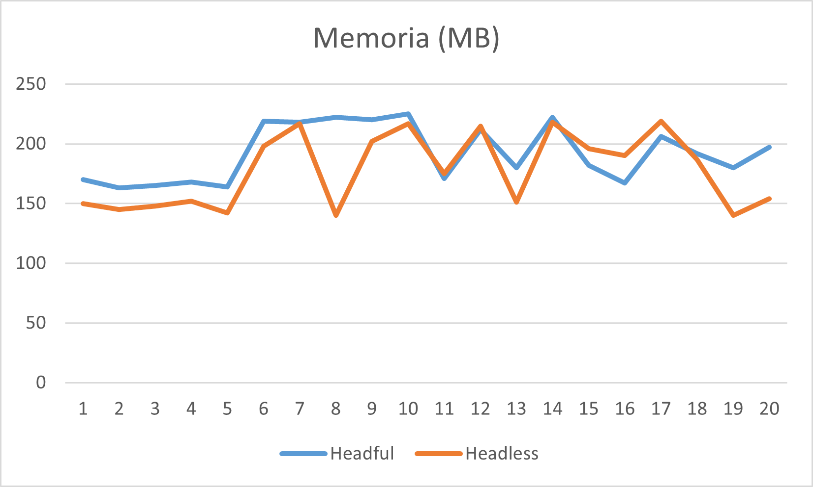
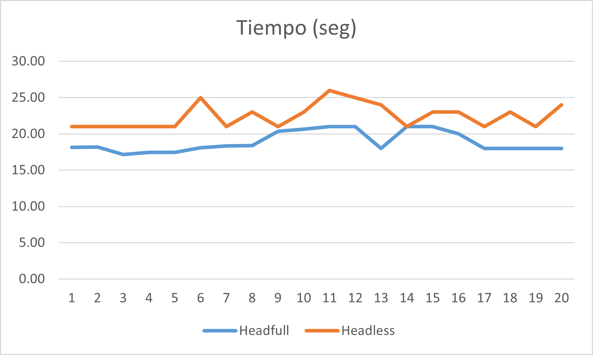
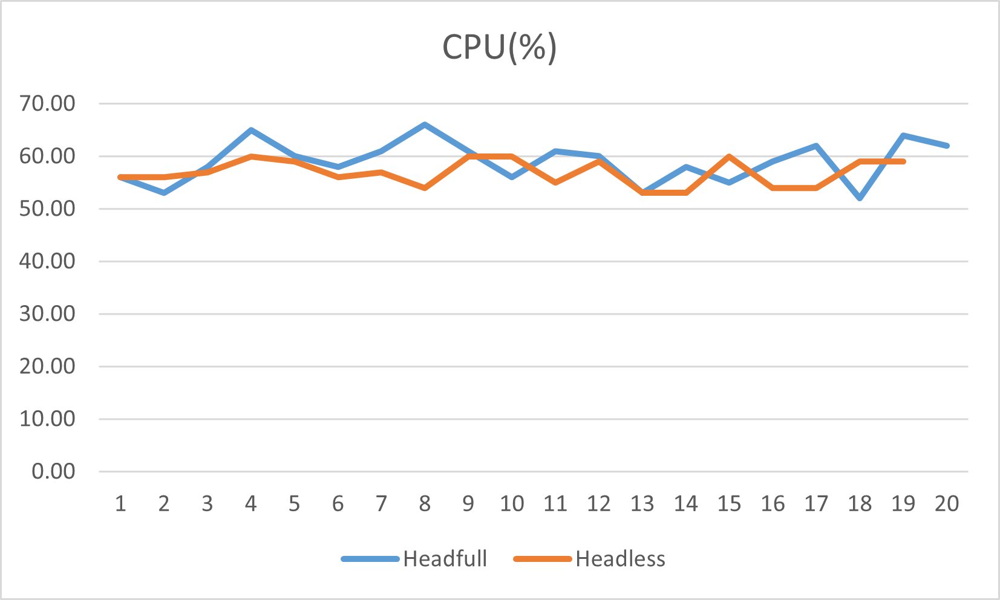
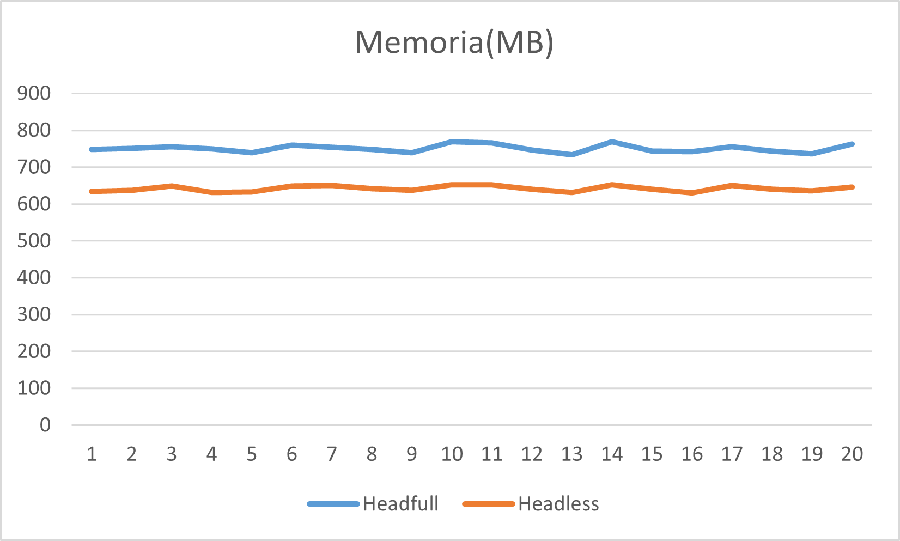
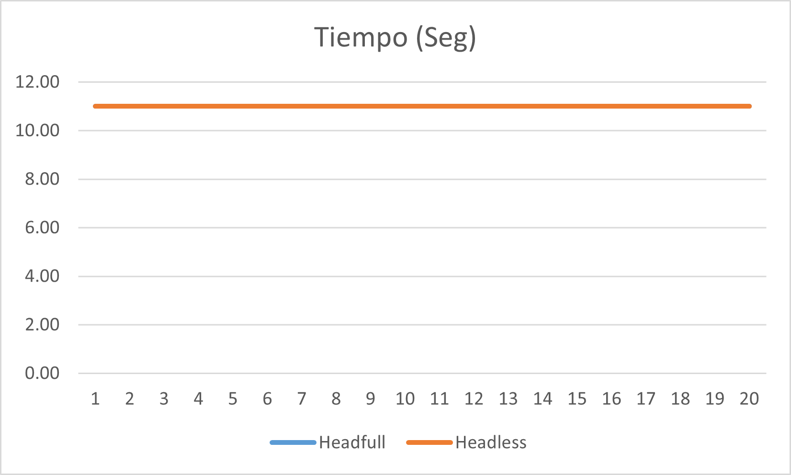

# Pruebas

## Lighthouse

**Lighthouse funciona correctamente** 

**Audit para el llamado al API** 

**Uso de CPU con pruebas en Cypress**

**Uso de Memoria con pruebas en Cypress**

**Tiempo de ejecución con pruebas en Cypress**

**Uso de CPU con pruebas en Protactor**

**Uso de Memoria con pruebas en Protactor**

**Tiempo de ejcución con pruebas en Protactor**

