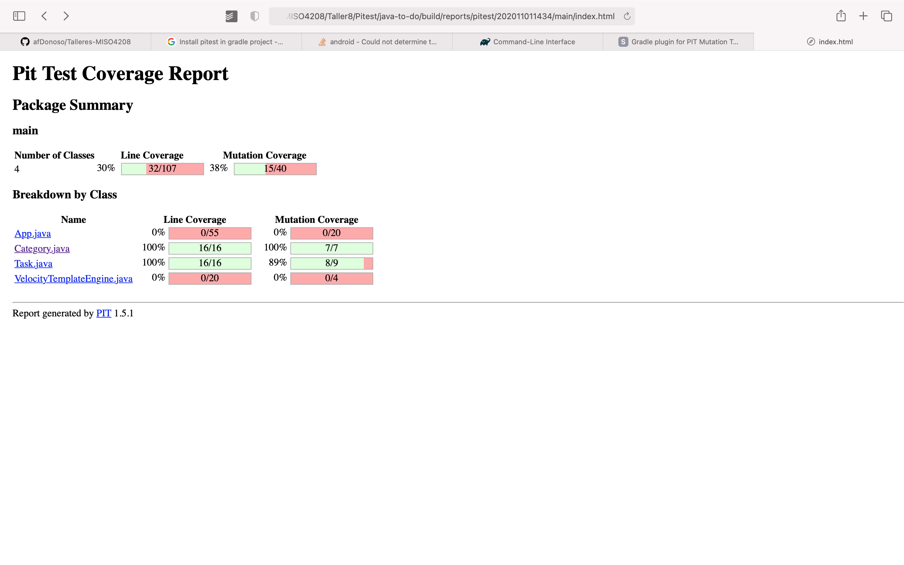

# Taller 8

## Pitest Report



## MDroid+

## MutAPK

Para la generación de los mutantes con MutAPK, tuvimos que realizar 2 cambios principales.

El primer cambio es indicar cuáles son los operadores que queremos utilizar para realizar las mutaciones.

```properties
1 = ActivityNotDefined
3 = InvalidActivityName
6 = NullIntent
5 = InvalidLabel
27 = FindViewByIDReturnsNull
```

Luego, cambiamos el archivo de configuración.

```json
{
  "apkPath": "./apk/habitica-3-0-1-1.apk",
  "appName": "com.habitrpg.android.habitica",
  "mutantsFolder": "./mutants",
  "operatorsDir": "./",
  "multithreadExec": "true",
  "ignoreDeadCode": "true",
  "extraPath": "./extra",
  "selectionStrategy": "amountMutants",
  "selectionParameters": {
    "amountMutants": "50"
  }
}
```

En este, definimos el apk que vamos a utilizar y el número de mutantes que queremos crear.

### Resultado

| Operador                |  Número de APKs |
| ----------------------- | --------------- |
| InvalidLabel            | 15              |
| ActivityNotDefined      | 1               |
| NullIntent              | 1               |
| FindViewByIDReturnsNull | 32              |
| InvalidActivityName     | 1               |
